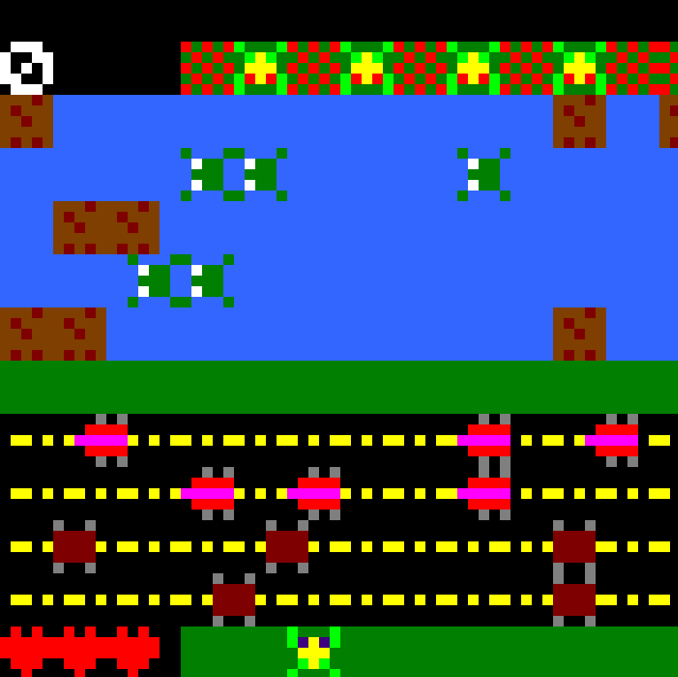

# MIPS Classic Frogger

The classic game of Frogger written in MIPS Assembly. Utilizes the MARS assembler.



### Table of Contents
- [Description](#description)
- [Installation & Setup](#installation--setup)
    -  [Clone the Repository](#1-clone-the-repository)
    -  [Install the MARS Assembler](#2-install-the-mars-assembler)
- [Usage](#usage)
    - [Some Assembly Required](#some-assembly-required)
    - [Play the Game](#play-the-game)
- [License](#license)

## Description
MIPS Classic Frogger is a recreation of the classic Frogger game, written in MIPS Assembly using the MARS assembler. It includes custom game logic, object rendering, and interactions, allowing users to assemble and play the game using a MIPS simulator.

Before beggining with the installation of the program, take a look at the structure of this project:
```
root/. 
└── src/.
│   ├── constants.asm
│   ├── display_2227_0611.asm - Handles the display logic for the game.
│   ├── frogger.asm - Think of this as 'main'
│   ├── game_constants.asm - Frog speed, obstacle patterns, etc.
│   ├── macros.asm
│   ├── map.asm
│   ├── obj.asm - Object rendering and interactions.
│   └── textures.asm
```

## Installation & Setup

### 1. Clone the Repository

If you haven't already, clone the repository:
```bash
git clone https://github.com/prebish/mips-classic-frogger.git
```

### 2. Install the MARS Assembler
  
Make sure you have a MIPS assembler and simulator installed. MARS is a commonly used MIPS simulator, which this project has been written with and assembled by.  
The origin repository can be found [here](https://github.com/thomasrussellmurphy/MARS_Assembler). However, for this project I will be using a fork created by [Jarrett Billingsley](https://github.com/JarrettBillingsley).  

Please follow the instructions based on your OS:

**Windows**

1. Download the `.exe` for MARS from the fork of the original assembler: [Mars_2247_0515-4.5.47515.exe](https://github.com/JarrettBillingsley/MARS_Assembler/raw/master/downloads/Mars_2247_0515-4.5.47515.exe)  
2. Double-click the .exe file to run
3. (Optional) MD5 Hash: `a3f57e49a2db6501d15c736df389d1ef`

**MacOS/Linux**

1. Make sure you have Java 11 or later installed. You can find what you need on the [Offical Oracle Downloads page](https://www.oracle.com/java/technologies/downloads/).  
2. Download the `.jar` file for MARS from the fork of the original assembler: [Mars_2247_0515.jar](https://github.com/JarrettBillingsley/MARS_Assembler/raw/master/downloads/Mars_2247_0515.jar)
3. You can run it by using the JVM like this: ```java -jar <jarfile>```  
4. (Optional) MD5 Hash: `20fcc20f176b80f63b26f5437b1a8795`

## Usage

### Some Assembly Required
Open the `.asm` files in your MIPS assembler and assemble them.

1. Go to **File > Open** in MARS.
2. Navigate to the `./mips-classic-frogger/src/` directory and select `frogger.asm`.
3. Click the **Assemble** button (resembles an 'X' made of tools).

### Play the Game
The project utilizes a tool included in the assembler for displaying gui objects.

1. Open **Tools > Keypad and LED Display Simulator**.
2. Click **Connect to MIPS**.
3. Click **Run** at the top, next to the Assemble button from before. Then you should be ready to play!

## License
This project is licensed under the **MIT License** - see the `LICENSE` file for details.
