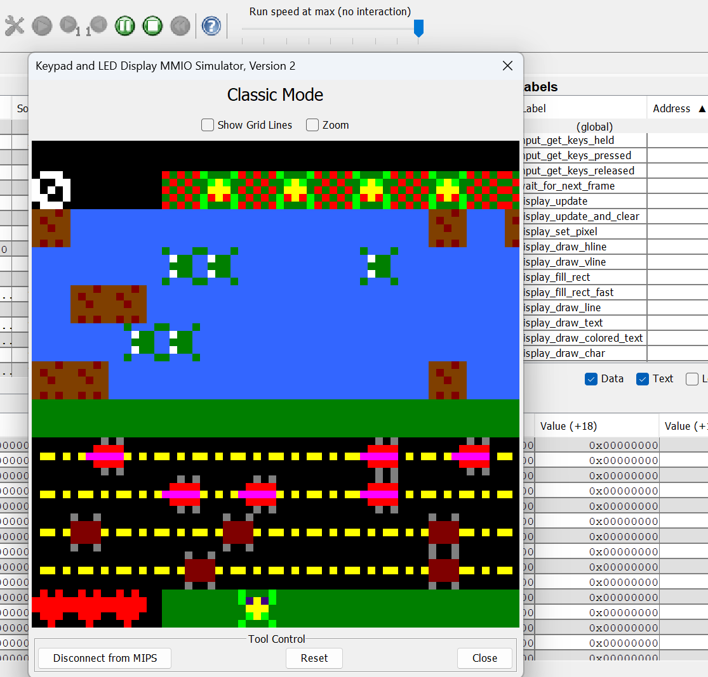

# MIPS Classic Frogger



The classic game of Frogger written in MIPS Assembly. Utilizes the MARS assembler.

## Table of Contents

- [Overview](#overview)
- [Installation & Setup](#installation--setup)
    1. [Install the MARS Assembler](#1-install-the-mars-assembler)
        - [Windows](#windows)
        - [MacOS/Linux](#macoslinux)
    2. [Clone the Repository](#2-clone-the-repository)
- [Usage](#usage)
    - [Some Assembly Required](#some-assembly-required)
    - [Its Game Time](#its-game-time)
- [License](#license)

## Overview

Before beggining with the installation of the program, make sure you understand the purpose of each `.asm` file. 

- **src/** - Contains all MIPS assembly source files:
  - `constants.asm` - Contains constant values used across the program.
  - `display_2227_0611.asm` - Handles the display logic for the game.
  - `frogger.asm` - The main game logic and entry point. (Think of this as 'main')
  - `game_constants.asm` - Game-specific constants like frog speed, obstacle patterns, etc.
  - `macros.asm` - Contains macros for common ops.
  - `map.asm` - Manages the game map and layout.
  - `obj.asm` - Handles object rendering and interactions.
  - `textures.asm` - Defines the textures used in the game.

## Installation & Setup

### 1. Install the MARS Assembler
  
Make sure you have a MIPS assembler and simulator installed. MARS is a commonly used MIPS simulator, which this project has been written with and assembled by.  
The origin repository can be found [here](https://github.com/thomasrussellmurphy/MARS_Assembler). However, for this project I will be using a fork created by [Jarrett Billingsley](https://github.com/JarrettBillingsley).  

Please follow the instructions below based on your Operating System.

#### **Windows**

1. Download the `.exe` for MARS from the fork of the original assembler: [Mars_2247_0515-4.5.47515.exe](https://github.com/JarrettBillingsley/MARS_Assembler/raw/master/downloads/Mars_2247_0515-4.5.47515.exe)  
2. Double-click the .exe file to run
3. (Optional) MD5 Hash: `a3f57e49a2db6501d15c736df389d1ef`

#### **MacOS/Linux**

1. Make sure you have Java 11 or later installed. You can find what you need on the [Offical Oracle Downloads page](https://www.oracle.com/java/technologies/downloads/).  
2. Download the `.jar` file for MARS from the fork of the original assembler: [Mars_2247_0515.jar](https://github.com/JarrettBillingsley/MARS_Assembler/raw/master/downloads/Mars_2247_0515.jar)
3. You can run it by using the JVM like this: ```java -jar <jarfile>```  
4. (Optional) MD5 Hash: `20fcc20f176b80f63b26f5437b1a8795`

### 2. Clone the Repository

If you haven't already, you will have to clone the repository to your machine.
```bash
git clone https://github.com/prebish/mips-classic-frogger.git
```

## Usage

### Some Assembly Required
Open the `.asm` files in your MIPS assembler and assemble them. For example, if you're using MARS:

1. Go to **File > Open** in MARS.
2. Navigate to the `./mips-classic-frogger/src/` directory and select `frogger.asm`.
3. Click the **Assemble** button (resembles an 'X' made of tools).

### Its Game time
The project utilizes a tool included in the assembler for displaying gui objects.

4. Open **Tools > Keypad and LED Display Simulator**.
5. Click **Connect to MIPS**.
6. Click **Run** at the top, next to the Assemble button from before. Then you should be ready to play!

## License

This project is licensed under the **MIT License** - see the `LICENSE` file for details.
